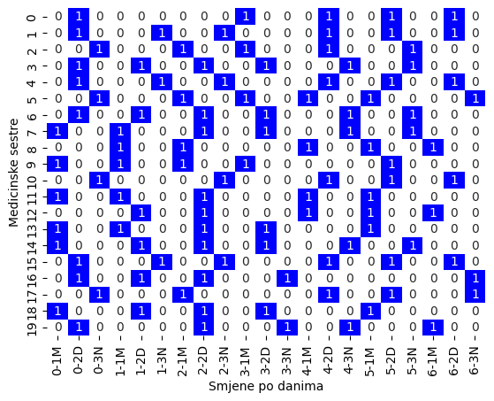

# Solving Nurse Scheduling Problem with Linear Programming

This repository contains a solution for the Nurse Scheduling Problem using linear programming with the PuLP library in Python. The goal is to schedule 20 nurses across 3 daily shifts over a period of 7 days while satisfying a set of constraints.

Nurse scheduling is a common problem in healthcare settings, where the objective is to create an optimal schedule for nurses that meets staffing requirements and respects various constraints. This project demonstrates how to use linear programming to solve the nurse scheduling problem using the PuLP library in Python.

We need to schedule 20 nurses to cover 3 daily shifts (morning, afternoon, and night) over a 7-day period. Each nurse can work only one shift per day, and there are several constraints that must be satisfied to ensure a fair and efficient schedule. We have the following constraints:

1. **One shift per day:** Each nurse can only work one shift per day.
2. **Minimum 5 days of work:** Each nurse must work at least 5 days in a week.
3. **Maximum 6 days of work:** Each nurse can work no more than 6 days in a week.
4. **Shift duration:** Each shift is 8 hours long.
5. **Staffing requirements:** Each shift requires a specific number of nurses.
6. **Rest period:** Each nurse must have at least 12 hours of rest between shifts.
7. **Night shifts:** Each nurse can work a maximum of 2 night shifts in a week.

Here is the visual representation of the solution:

